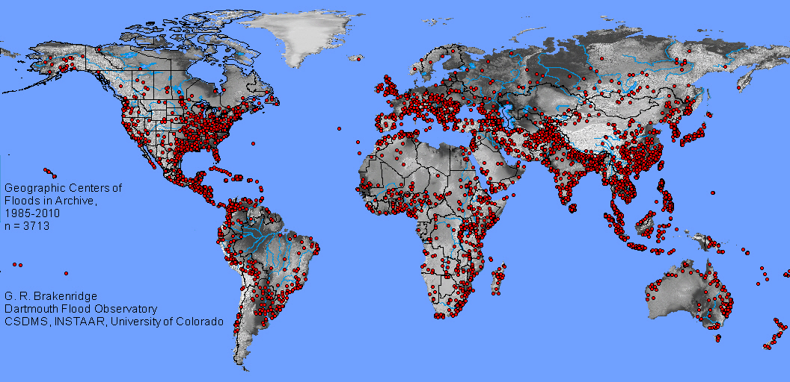
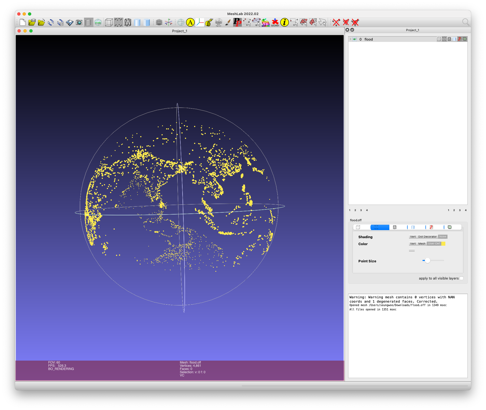

<div align=center>
  <h1>
  Modeling the Distribution of Natural Disasters using Diffusion Models  
  </h1>
  <p>
    <a href=https://mhsung.github.io/kaist-cs492d-fall-2024/ target="_blank"><b>KAIST CS492(D): Diffusion Models and Their Applications (Fall 2024)</b></a><br>
    Course Project
  </p>
</div>

<div align=center>
  <p>
    Instructor: <a href=https://mhsung.github.io target="_blank"><b>Minhyuk Sung</b></a> (mhsung [at] kaist.ac.kr)<br>
    TA: <a href=https://dvelopery0115.github.io target="_blank"><b>Seungwoo Yoo</b></a>  (dreamy1534 [at] kaist.ac.kr)
  </p>
</div>

<div align=center>
   
   <figcaption>
    A map showing significant floods around the world based on data from the Global Active Archive of Large Flood Events managed by Dartmouth Flood Observatory (DFO).
    <i>Source: <a href="https://floodobservatory.colorado.edu/Archives/index.html">Dartmouth Flood Observatory (DFO).</a></i>
    </figcaption>
</div>

## Abstract
In this project, you will design diffusion models for modeling the distribution of locations where natural disasters took place. You will use real-world data provided by [NOAA National Centers for Environmental Information (NCEI)](https://www.ngdc.noaa.gov/ngdc.html) (earthquakes), [Dartmouth Flood Observatory](https://floodobservatory.colorado.edu/index.html) (flood), and [NASA's Earth Science Data Systems (ESDS) Program](https://earthdata.nasa.gov) (fire) to train and evaluate your models.

## Data Specification
Under the directory `data`, you will find the following files:
- `earthquake.tsv`: A tab-separated file containing 5447 locations of earthquakes.
- `flood.tsv`: A tab-separated file containing 4861 locations of floods.
- `fire.tsv`: A tab-separated file containing 12801 locations of fires.

All files contain training data each consisting of the following fields:
- `Latitude`: Latitude of the location where a natural disaster occurred in degrees.
- `Longitude`: Longitude of the location where a natural disaster occurred in degrees.

We provide a script `scripts/convert_to_xyz.py` for converting the locations represented as (Latitude, Longitude) to 3D coordinates. You can use the following command to run the script:
```
python scripts/convert_to_xyz.py --in-file {PATH TO TSV FILE}
```
The script will generate an `.off` file containing the 3D coordinates of the locations. Note that we assume a sphere with a radius of 1 when converting spherical coordinates to Cartesian coordinates.

You can visualize the converted points using tools of your choice, such as [MeshLab](https://www.meshlab.net). The following figure shows the point cloud viewed on MeshLab.
<div align=center>
   
   <figcaption>
    A 3D point cloud representing the locations of significant floods, converted from the original (Latitude, Longitude) coordinates using the script `scripts/convert_to_xyz.py`.
    </figcaption>
</div>

## Tasks
Design and implement your own diffusion model for modeling the distribution of natural disasters. For each dataset, compute the evaluation metrics listed in the next section to assess the performance of your model(s).

## Evaluation
After generating the samples in the form of (Longitude, Latitude), you will evaluate the performance of your model by measuring the coverage (COV) and minimum matching distance (MMD).
Specifically, the coverage is defined as the percentage of the ground truth samples that are the closest neighbors of the generated samples, and the minimum matching distance is the average distance between the generated samples and their closest neighbors in the ground truth samples.

To compute the aforementioned metrics, run the command:
```
export PYTHONPATH=.  # Needed only once
python scripts/eval.py --gen-pts-path {PATH TO GENERATED POINTS}
```
The script `scripts/eval.py` expects either:
  1. a `.csv`/`.tsv` file containing a table with two columns: `Longitude` and `Latitude` or,
  2. a `.npy` file containing a numpy array of shape `(N, 2)` where `N` is the number of samples, and the first and second columns correspond to `Longitude` and `Latitude`, respectively.
Note that the `Longitude` and `Latitude` values are represented in degrees.
